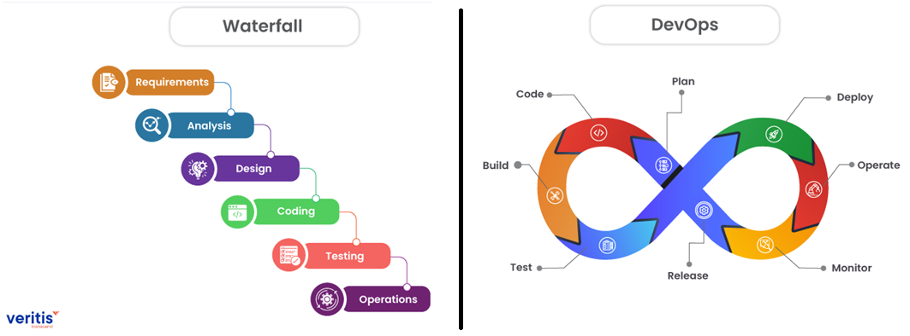

## Actividad 1: Introducción a DevOps y DevSecOps

-   Nombre: Diego Edson Bayes Santos
-   Fecha: 30/08/2025
-   Tiempo total:
-   Entorno usado:

### DevOps vs. Cascada Tradicional (Investigación + Comparación)

El modelo cascada tradicional o Waterfall aborda el desarrollo de software de manera secuencial, en el cual cada etapa del proyecto se inicia una detrás de otra. Esto genera demoras grandes en las entregas:

-   Los errores se detectan en las etapas finales por lo que se debe reiniciar la secuencia para corregirlos
-   Pequeños cambios en los requerimientos deben esperar a que el desarrollo actual acabe su proceso
-   No se obtiene feedback inmediato, sino hasta el final del despliegue.
    Por otro lado, la metodología DevOps consiste en un desarrollo iterativo, mediante el cual se sigue la secuencia desde planeamiento hasta lanzamiento en pequeños lotes, a diferencia de todo el proyecto. Esto incluye la creación de procesos automatizados de compilación, integración y testing, de tal forma que se pueda detectar inmediatamente cuando un cambio nuevo evita el correcto funcionamiento y despliegue (Kim et al., 2016). Es decir, la detección de errores e implementación del feedback se realiza de manera continua y a corto plazo. Además, uno de sus pilares es la automatización de procesos, la cual disminuye el riesgo del factor humano en distintas etapas del desarrollo.

Adicionalmente, no todos los casos presentan a DevOps como la mejor opción. En el campo de los software embebidos para dispositivos médicos, cada producto debe cumplir con ciertas normativas y regulaciones estrictas. El ciclo de vida está muy regulado y exige que cada fase del desarrollo se documente y se apruebe antes de pasar a la siguiente. Esta conformidad regulatoria está a cargo de auditorías externas como la FDA o las certificadoras ISO y es de caracter obligatorio. Además, el acoplamiento del hardware con el software es crítico y requiere entornos físicos específicos que dificultan la iteración del desarrollo y elevan los costos de reprocesos. En esta situación, se sacrifica la velocidad del DevOps, para adoptar la conformidad y seguridad de la metodología Waterfall.

### Referencias

-   Kim, G., Debois, P., Willis, J., Humble, J., & Allspaw, J. (2016). The DevOps Handbook: How to Create World-Class Agility, Reliability, and Security in Technology Organizations. IT Revolution Press.
-   The Qt Company. (s. f.). Ensuring safety and saving lives: A complete guide to software testing in the medical device industry. Recuperado de https://www.qt.io/quality-assurance/medical-device-software-testing-guide
