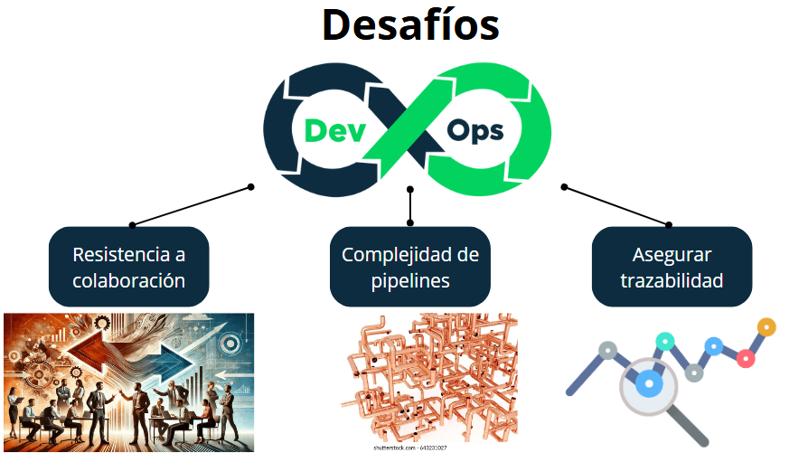
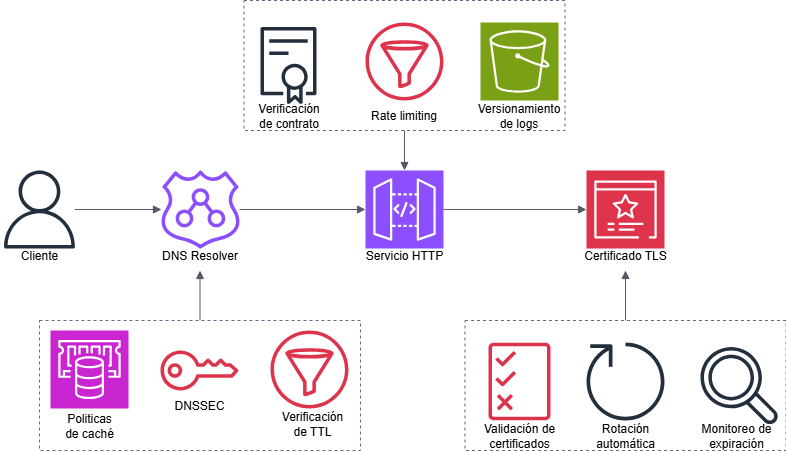

## Actividad 1: Introducción a DevOps y DevSecOps

-   Nombre: Diego Edson Bayes Santos
-   Fecha: 30/08/2025
-   Tiempo total: 5h
-   Entorno usado: Esta actividad se realizó en una laptop personal con el sistema operativo Windows, en el IDE Visual Studio Code.

### 1. DevOps vs. Cascada Tradicional (Investigación + Comparación)

El modelo cascada tradicional o Waterfall aborda el desarrollo de software de manera secuencial, como se muestra en la imagen, mediante el cual cada etapa del proyecto se inicia una detrás de otra. Esto genera demoras grandes en las entregas:

-   Los errores se detectan en las etapas finales por lo que se debe reiniciar la secuencia para corregirlos
-   Pequeños cambios en los requerimientos deben esperar a que el desarrollo actual acabe su proceso
-   No se obtiene feedback inmediato, sino hasta el final del despliegue.

Por otro lado, la metodología DevOps consiste en un desarrollo iterativo, mediante el cual se sigue la secuencia desde planeamiento hasta lanzamiento, siguiendo el recorrido mostrado en la imagen, y en pequeños lotes, a diferencia de todo el proyecto. Esto incluye la creación de procesos automatizados de construcción, integración y testing, de tal forma que se pueda detectar inmediatamente cuando un cambio nuevo evita el correcto funcionamiento y despliegue (Kim et al., 2016). Es decir, la detección de errores e implementación del feedback se realiza de manera continua y a corto plazo. Además, uno de sus pilares es la automatización de procesos, la cual disminuye el riesgo del factor humano en distintas etapas del desarrollo.

Adicionalmente, no todos los casos presentan a DevOps como la mejor opción. En el campo de los software embebidos para dispositivos médicos, cada producto debe cumplir con ciertas normativas y regulaciones estrictas. El ciclo de vida está muy regulado y exige que cada fase del desarrollo se documente y se apruebe antes de pasar a la siguiente. Esta conformidad regulatoria está a cargo de auditorías externas como la FDA o las certificadoras ISO y es de caracter obligatorio. Además, el acoplamiento del hardware con el software es crítico y requiere entornos físicos específicos que dificultan la iteración del desarrollo y elevan los costos de reprocesos. En esta situación, se sacrifica la velocidad del DevOps, para adoptar la conformidad y seguridad de la metodología Waterfall.

### 2. Ciclo tradicional de dos pasos y silos (limitaciones y anti-patrones)

Existen importantes limitaciones del ciclo "construcción -> operación" sin integración continua:

-   En el entorno tradicional, por lo general, se cuenta con los equipos de Desarrollo, QA y Operaciones. Ellos operan de manera aislada, tal como se representa en la imagen, por lo que las solicitudes se trabajan en un sistema de tickets. Esto genera cuellos de botella que retrasan el desarrollo al cada equipo presentar sus propias responsabilidades y prioridades. Por ejemplo, si el equipo de QA identifica un error crítico que evita el análisis del resto del código, solicita un cambio en el código al equipo de Desarrollo (_handoff_ de tareas). Ahora, deben esperar a su resolución para continuar con el resto de pruebas, alargando así el tiempo total de entrega.
-   Otro gran problema es el desentendimiento de las responsabilidades. Cada equipo cuenta con su propio conjunto de responsabilidades y prioridades. El objetivo del equipo de desarrollo suele ser entregar la mayor cantidad de código al equipo de QA para que este lo valide, lo cual reduce drásticamente la calidad del código y, por ende, incrementa el tiempo en la construcción de código validado y probado. El equipo de operaciones opta por un entorno más estable, debido a que cada cambio conlleva potenciales errores en producción. El ambiente suele estar fuertemente marcado por los elogios al equipo de Desarrollo en casos de éxito y a la responsabilización del equipo de Operaciones en casos de fallos.

Asimismo, se pueden identificar ciertos anti-patrones:

-   _Throw over the wall_: Hace referencia a la existencia de barreras de comunicación y colaboración entre estos equipos que funcionan como silos organizacionales. Tal como se indicó antes, los equipos se centran en realizar sus actividades y _lanzarlas_ rápidamente al siguiente equipo, lo que dificulta el trabajo de este último al recibir resultados mínimamente viables. Además, estos muros también generan mayor tiempo promedio de reparación (_MTTR_), pues ante la presencia de errores, ralentiza la comunicación y la eficacia en resolución de errores.
-   _Seguridad como auditoría tardía_: Sin integración continua, el análisis de la seguridad se suele desplazar al final del ciclo de desarrollo. Sin embargo, la identificación de fallos tardía genera _retrabajos_ costosos en el rediseño y reconstrucción de componentes previamentes funcionales, muchas veces incluso iniciando el código desde cero.

### 3. Principios y beneficios de DevOps (CI/CD, automatización, colaboración; Agile como precursor)

La integración continua (CI) se desarrolla en la primera etapa del ciclo DevOps, desde construcción hasta las pruebas. Consiste en trabajar con cambios más pequeños que se van integrando al software iterativamente y tras ser probados, unitariamente y en conjunto con los existentes. Debido al aumento en el número de cambios, es crucial que el proceso de pruebas sea automatizado, para agilizar el desarrollo y reducir el riesgo de errores manuales. Por otra parte, la entrega continua (CD) recibe los cambios validados en la etapa de desarrolo y tiene como resultado disponibilizar el software para ser puesto en producción. Incluye procesos automatizados de revisión y pruebas más amplias en entornos simulados que replican el de producción. Ambos procesos (CI y CD) requieren de la colaboración de todo el equipo para construir, probar y entregar cada componente.  
En este sentido de colaboración, las prácticas Agile como las reuniones diarias y la recopilación de feedback son importantes para mantener el sentido de unidad del equipo y mejorar la toma de decisiones en el pipeline. Se tiene mayor información, gracias a los resultados inmediatos y las métricas observadas, para priorizar tareas y eliminar otras.  
Una muestra de la agilización y la mejora de la colaboración del DevOps es el tiempo que transcurre desde un Pull Request, es decir desde que se agrega un cambio validado a la rama principal de desarrollo, hasta su despliegue en entorno de pruebas. Este suele ser mucho más rápido al implementar cambios más pequeños y procesos automatizados, a diferencia de un entorno tradicional que emplea Waterfall. Adicionalmente, este medidor puede ser registrado automáticamente mediante las herramientas que ya se usan generalmente en DevOps, tales como Git para el control de versiones e historial de los PRs y el logging implementado en la fase de despliegue.

### 4. Evolución a DevSecOps (seguridad desde el inicio: SAST/DAST; cambio cultural)

El SAST (Static Application Security Testing) es una técnica que analiza el código de una aplicación para identificar vulnerabilidades dentro del código mismo, es decir sin ser ejecutado; mientras que DAST (Dynamic Application Security Testing) lo prueba desde el exterior y en ejecución, simulando la perspectiva de un ataque de seguridad (Synack, s. f). El primero puede ser utilizado durante las etapas de CI como un añadido de seguridad. DAST se emplea en entornos de _staging_ dentro del CD para detectar vulnerabilidades del software en ejecución.  
Un ejemplo de gate mínimo de seguridad puede estar definido con los siguientes umbrales:

-   Umbral 1: Se requiere 0 vulnerabilidades críticas o de alta severidad (CVSS $\geq$ 7.0) detectadas por SAST durante la integración continua.
-   Umbral 2: El 95% de las pruebas que involucren datos del usuario deben ser validadas por DAST en el entorno de _staging_.

Además, una política de excepción puede ser la siguiente:

-   Descripción: Se permite una vulnerabilidad crítica por falta de prioridad
-   Fecha de caducidad: 2 semanas
-   Responsable: Líder técnico
-   Plan de correción: Aplicar mitigación temporal hasta el desarrollo del componente necesario para remover la vulnerabilidad por completo.

Por último, para evitar el avance del desarrollo sin reducción real de riesgos, se deben proponer métricas como las siguientes:

-   Señal de eficacia 1: Las vulnerabilidades repetidas entre cambios representan menos del 10% en una iteración. Pueden ser comparadas automáticamente mediante el historial de informes de SAST y DAST.
-   Señal de eficacia 2: El promedio en el tiempo de remediación de una vulnerabilidad decrece con el tiempo. También medible con el historial de informes previamente mencionado.

### 5. CI/CD y estrategias de despliegue (sandbox, canary, azul/verde)

Para un microservicio crítico como el sistema de pagos, se opta por una estrategia de _canary_, debido a que es fallos en esta área puede implicar problemas legales y un gran impacto en la confiabilidad del software y la empresa propietaria, por lo que reducir el despliegue inicia a un conjunto pequeño de usuarios, mitiga el número de incidencias.

| Riesgo                                   | Mitigación                                                                |
| ---------------------------------------- | ------------------------------------------------------------------------- |
| **Costo operativo del doble despliegue** | Definir un límite máximo de convivencia para la versión anterior.         |
| **Incremento en latencia**               | Pruebas de carga automatizadas previas y monitoreo de KPIs en producción. |
| **Alcance limitado**                     | Selección correcta de cantidad y diversidad de usuarios.                  |

Para este caso, se puede utilizar el porcentaje de respuestas _5XX_ como KPI primario.

-   Umbral: $\leq$ 0.5% de errores _5XX_
-   Ventana de observación: 30 minutos

Adicionalmente, si se cumplen los KPIs técnicos, pero se cae alguna métrica de producto, se debe reevaluar la toma de decisiones, pues se puede generar frustración en los usuarios a pesar de la carencia de errores técnicos. Estas métricas de producto, por ejemplo la tasa de cancelación de compra, reflejan el impacto real de los cambios a nivel financiero.

### 6. Fundamentos prácticos sin comandos (evidencia mínima)

#### HTTP - contrato observable

Para la URL seleccionada, se reporta lo siguiente:

-   Se registró el método GET, tal como se esperaba por defecto al no solicitar otro método.
-   Se recibió 200 como _status code_ indicando la respuesta exitosa.
-   Cabeceras clave: _cache-control_ y _x-cache_

La cabecera _cache-control_ es importante para temas de rendimiento. Al no almacenar caché, se aumenta la latencia percibida y se incrementa la carga en el servidor, a cambio de siempre obtener la versión más reciente. Se debe incluir cabecera de trazabilidad para la observabilidad. Por otro lado, _x-cache_ da visibilidad sobre el status del caché para el CDN. Esto permite monitorear la cantidad de HITs en comparación a la cantidad de MISS para detectar posibles fallas en la optimización.

#### DNS - nombres y TTL

Para la URL seleccionada, se reporta lo siguiente:

-   Se identificó el tipo de registro CNAME, usado para alias
-   Se registró un TTL de 0, por lo que la respuesta es descartada inmediatamente.

Los TTL bajos permiten _rollbacks_ más rápidos al tener menor latencia entre los cambios, con el sacrificio de tener que realizar mayor cantidad de consultas y, por lo tanto, mayores recursos empleados.

#### TLS - seguridad en el tránsito

Para la URL seleccionada, se reporta lo siguiente:

-   El certificado principal incluye 'uni.pe' como CN y una vigencia desde el 23 de febrero del 2025 hasta el 24 de marzo del 2026.
-   La emisora del certificadora principal es Amazon RSA 2048 M02, y siguiendo la cadena de certificados, la certificadora inicial es Starfield Services Root Certificate Authority.

La verificación de la cadena de certificados es un paso fundamental en la implementación de la seguridad de un software. El riesgo principal es el acceso a un canal no seguro producto de un certificado falso. Esto conlleva posibles ataques _man-in-the-middle_ (MITM) en los que se simula estar conectado al servicio original para obtener, modificar o borrar la información transmitida.

#### Puertos - estados de runtime

Para mi máquina, se identifican los siguientes puertos en escucha:

-   Puerto 80: Por defecto, el puerto usado para peticiones HTTP
-   Puerto 443: Por defecto, el puerto asignado para el protocolo HTTPS

El estado LISTEN o en escucha indica que el puerto se encuentra disponible para su uso. Por lo tanto, mediante esta herramienta, se puede detectar si un puerto no ha sido expuesto correctamente (despliegues incompletos) o si se encuentra actualmente ocupado por otro servicio.

#### 12-Factor - port binding, configuración, logs

-   Para asignar un puerto sin necesidad de definirlo en código, se puede usar variables de entorno y automatizar su parametrización mediante archivos de configuración (por ejemplo, con el uso de YAML).
-   En un flujo estándar, los logs en ejecución se escriben en los canales _stdout_ o _stderr_. Estos se pueden recolectar con herramientas del contenedor usado y escribirlos localmente rompería la portabilidad y dificultaría su recopilación tras varias iteraciones.
-   El antipatrón de _hard-coded credentials_ rompe la tercera regla del 12-Factor e impacta seriamente tanto en la seguridad como en la reproducibilidad del código en diferentes ambientes (con diferentes credenciales o generación de credenciales temporales).

#### Checklist de diagnóstico (incidente simulado)

-   Se verifica el contrato HTTP con el objetivo de confirmar la respuesta válida del servidor. Una respuesta con un código de estado 200 es esperada para indicar una conexión correcta. Si se recibe _5XX_, se revisa el servidor backend.
-   Se verifica la resolución DNS para descartar inconsistencias en los registros. Se espera el mismo IP en todos los _resolvers_ para mostrar una resolución estable. Si se encuentran diferencias, se revisa el proceso de configuración.
-   Se valida la vigencia del certificado TLS. La fecha actual debe estar en el rango recibido y la cadena de certificados debe mostrar un CA confiable. Si se comprueba caducidad o CN/SAN incorrectos, se procede a renovar el certificado.
-   Se revisa mide la latencia del TLS handshake. Se espera tiempos menores a los permitidos para confirmar que no existan _timeouts_. Si la latencia es mayor, se revisa las configuraciones de red y de seguridad para buscar posibles vulneraciones.
-   Se lista los puertos en escucha para confirmar que estén disponibles para su uso. Se espera que se encuentren en estado LISTEN. Si se detecta un puerto ausente u ocupado, se revisa la configuración del _port binding_.
-   Se correlacionan los logs de aplicación y reverse proxy para determinar el origen de la intermitencia. Según la respuesta, se determina la causa como un backend saturado o intermitencia en la red del cliente.

### 7. Desafíos de DevOps y mitigaciones

#### Riesgos y mitigaciones

-   La detección de vulnerabilidades críticas que no fueron identificadas durante su desarrollo ni revisión puede ser mitigada con despliegues graduales como el despliegue _canary_ para no afectar a la totalidad de usuarios.
-   La revisión no exhaustiva del código por parte de algún miembro de un equipo DevOps puede conllevar a generar errores lógicos en el programa y en las pruebas. Se mitiga mediante estrategias de colaboración como la revisión cruzada en cada etapa del desarrollo.
-   Posibles fallas en servicios pueden afectar al resto y provocar una falla total del software, a pesar de la arquitectura poco acoplada. Se deben implementar patrones como _circuit breaker_ o _bulkhead_ para disminuir el alcance del error o _blast radius_.

#### Experimento controlado

Se debe actualizar una versión de software y se presentan 2 alternativas. Una estrategia de despliegue _blue-green_ en la cual se aplica los cambios a todos los usuarios, pero se mantiene en producción la versión anterior para permitir una reversión rápida; y una estrategia de despliegue gradual en la que se va liberando la nueva versión a un porcentaje de usuarios cada vez mayor. Para criterios del experimento, se injectará una intermitencia en la latencia en la nueva versión.

-   Métrica primaria: Cantidad de errores _5XX_ tras la primera hora del release
-   Grupo de control: Se divide a los usuarios en 2 grupos similares. El primer grupo se actualizará a la nueva versión simultáneamente (_big bang_) y al segundo se le liberará progresivamente: 5% del grupo inicialmente, 25% tras 15 minutos, 50% tras 30 minutos y 100% tras 45 minutos. Cada etapa del segundo grupo iniciará únicamente si la etapa anterior presenta una tasa de error $\leq$ 1%.
-   Criterio de éxito: El despliegue gradual debe mostrar una tasa de error mucho menor (por ejemplo $\leq$ 50%) del despliegue _big bang_ debido a la diferencia en la cantidad de usuarios en cada grupo y el tamaño de la ventana para detección de errores.
-   Plan de reversión: Se detiene el _rollout_ para el segundo grupo y se revierte a la versión anterior al segmento afectado. Para el primer grupo, se realiza un _rollback_ completo e inmediato gracias al despliegue _blue-green_.

### 8. Arquitectura mínima para DevSecOps (HTTP/DNS/TLS + 12-Factor)

La primera capa asegura la integridad del despliegue y evita inconsistencias entre entornos. Una selección correcta de las políticas de caché y ajuste del TTL ayuda a una propagación rápida de cambios. El uso de HTTP previene errores en cambios de versión. Se recomienda almacenar los logs de resultados. Además, una validación de certificados en la última capa permite verificar la confiabilidad del software. Se acompaña de nua rotación automática y monitoreo de expiración para presentar los certificados válidos en todo momento.  
El software debe comportarse similar en los diferentes entornos (principio 10) para agilizar el despliegue. Debe haber diferencias mínimas en los entornos y se debe monitorear los manifiestos para evitar incongruencias y solo variar las variables de entorno. Además, cada etapa debe tratar a los logs como un flujo de eventos, en vez de independientes, para mejorar la trazabilidad de todo el monitoreo.
