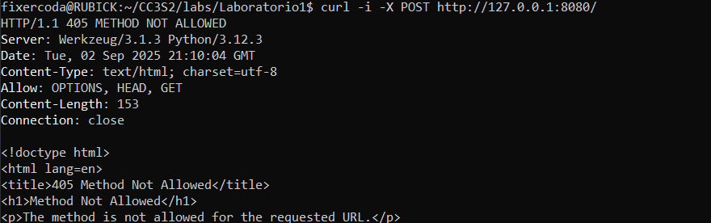

## Actividad 2: HTTP, DNS, TLS y 12-Factor (port binding, configuración, logs)

-   Nombre: Diego Edson Bayes Santos
-   Fecha: 02/09/2025
-   Tiempo total: 4h
-   Entorno usado: WSL en laptop personal Windows, en el IDE Visual Studio Code

### HTTP: Fundamentos y herramientas

-   Se levantó la app mediante Flask y con el uso de variables de entorno.


-   Se utilizó _curl_ para verificar que la app esté corriendo.


-   Se fuerza el uso de POST en el comando, pero como el script de la aplicación no acepta este método, se recibe el _status code 405_ que indica uso de un método inválido.



-   A pesar del cambio, el mensaje no se modifica. Esto ocurre porque las configuraciones de entorno se realizan una vez al inicio del proceso.


-   Se puede verificar que el puerto 8080 se encuentra en escucha, mediante el comando _ss_


-   Los logs están configurados y formateados para salir por _stdout_. De acuerdo al principio XI de la metodología 12-Factor, los logs se tratan como flujos de eventos y no como archivos. Son los propios contenedores que permiten extraer estos logs mediante el stdout para su monitorización. De esta manera, se asegura la desechabilidad de cada instancia al no depender de archivos creados dentro de estos.

```
    print(f"[INFO] GET /  message={MESSAGE} release={RELEASE}", file=sys.stdout, flush=True)
    return jsonify(
        status="ok",
        message=MESSAGE,
        release=RELEASE,
        port=PORT,
    )
```


-   La idempotencia, en este ámbito, es una característica de algunos métodos HTTP para producir el mismo resultado para la misma operación. Por este motivo, los métodos como GET o PUT se pueden usar libremente cuando se necesiten operaciones con varios reintentos o para _health checks_ como se utilizó anteriormente. A diferencia de PUT, el método POST crea un recurso nuevo tras cada operación, por lo quen o se considera idempotente. Sin embargo, para casos de reintentos con POST, se pueden emplear _idempotency keys_ mediante _headers_ añadidas en el comando para poder identificar las operaciones.


### DNS: nombres, registros y caché

-   Se empló _make hosts-setup_ para agregar la dirección a etc/hosts


-   Para comprobar que se resuelve miapp.local a 127.0.0.1, se utilizó el comando _dig_. Además, se utilizó _getent_ para consultar su ubicación en el mismo etc/hosts


-   Se observa un TTL de 0 segundos, lo que implica que el servidor no utiliza caché para sus resoluciones DNS. En un caso regular, se consulta primero si la respuesta se encuentra almacenada en caché. De ser así, se entrega esa respuesta. De lo contrario, se genera una nueva consulta y se reinicia el TTL. Por regla general, TTLs altos implican menos latencia y menos uso de recursos, debido a la menor cantidad de consultas; mientras que TTLs bajos permite la propagación de cambios más rápida (debido a que todo cambio debe esperar a que el TTL se reinicie).


-   El archivo /etc/hosts es local y asigna nombres a IPs de manera estática de manera interna. En cambio, una zona DNS autoritativa provee respuestas oficiales que se distribuyen de manera global y accesible. Dado que en este laboratorio, se realizó un despliegue local, el archivo /etc/hosts fue suficiente para evitar montar una infraestructura DNS. Esto no es viable para producción porque no es escalable y habría fallos constantes en la consistencia entre los usuarios.

### TLS: seguridad en tránsito con Nginx como reverse proxy

-   Se empló _make tls-cert_ para generar el certificado y la llave, el cual también lo ubica en la ruta esperada.


Configura Nginx: usa el ejemplo provisto para terminación TLS y proxy_pass a http://127.0.0.1:8080; con cabeceras X-Forwarded-\*. Luego nginx -t y reinicia el servicio. Incluye el snippet clave de tu server en el reporte.

-   Se incluyó en el archivo .conf los ajustes necesarios para el reverse proxy. Luego, se utilizó _make nginx_ para iniciarlo.

```
location / {
    proxy_pass http://127.0.0.1:8080;
    proxy_set_header Host $host;
    proxy_set_header X-Forwarded-For $remote_addr;
    proxy_set_header X-Forwarded-Proto https;
}
```


-   Se abrió la conexión TLS al host y puerto indicados con su SNI indicado (miapp.local) con el uso de _openssl_. El uso de SNI permite relacionar el certificado necesario con un nombre para su identificación durante el _handshake_. Se puede verificar que el nombre (CN) coincide con el brindado.


-   Se realizó una validación de la conectividad con la nueva dirección. El _flag -k_ permite ignorar la validación de certificados, necesarios para certificados de prueba que no cuentan con un CA confiable.


-   Se puede visualizar la presencia de ambos sockets en escucha.


-   Además, se utilizó _journalctl_ para obtener los últimos 10 logs que muestran el reinicio y el lanzamiento del _nginx_.

```
Sep 03 00:17:26 RUBICK systemd[1]: Starting nginx.service - A high performance web server and a reverse proxy server...
Sep 03 00:17:26 RUBICK systemd[1]: Started nginx.service - A high performance web server and a reverse proxy server.
Sep 03 00:17:33 RUBICK systemd[1]: Reloading nginx.service - A high performance web server and a reverse proxy server...
Sep 03 00:17:33 RUBICK nginx[87881]: 2025/09/03 00:17:33 [notice] 87881#87881: signal process started
Sep 03 00:17:33 RUBICK systemd[1]: Reloaded nginx.service - A high performance web server and a reverse proxy server.
```

### 12-Factor App: port binding, configuración y logs

-   Como parte del principio VII del 12-Factor, se puede evidenciar mediante _ss_ que el puerto 8080 se encuentra en escucha (LISTEN), tal como se configuró al inicio.


-   Se observa que el uso de diferentes variables de entorno no afecta el funcionamiento de la aplicación, tal como se espera del principio Config. Diferentes ambientes como desarrollo y producción, presentan diferentes variables de entorno, pero la modificación de estas no debe alterar la ejecución esperada.


Logs a stdout: redirige a archivo mediante pipeline de shell y adjunta 5 líneas representativas. Explica por qué no se configura log file en la app.

-   Se redirigió el pipeline a un archivo _app.log_. Como se mencionó antes, esto no es recomendado debido a que se pierde la desechabilidad del entorno y dificulta el registro dinámico de logs. Los contenedores cuentan con herramientas internas que les permite leer directamente el stdout y almacenarlos como flujos de eventos en cada etapa del CI/CD.


```
 * Serving Flask app 'app'
 * Debug mode: off
[INFO] GET /  message=Hola CC3S2 release=v1
[INFO] GET /  message=Hola CC3S2 release=v1
[INFO] GET /  message=Hola CC3S2 release=v1
```

### Operación reproducible (Make/WSL/Linux)

-   La herramienta _curl_ valida la funcionalidad, es decir si el servicio responde HTTP. En cambio, _ss_ valida el nivel de transporte mediante la verificación de puertos en modo escucha.

-   Los logs de nginx (mostrados con _journalctl_) permiten determinar causas de errores. Por ejemplo, si un puerto esta abierto (verificación con _ss_ exitosa), pero se muestra un código de estado fallido (validación HTTP con _curl_ fallida), se pueden revisar los logs para buscar _timeouts_ o fallas de respuesta.

| Comando          | Resultado esperado                                                                              |
| ---------------- | ----------------------------------------------------------------------------------------------- |
| curl             | Resolución de host, conexión TCP, cabeceras HTTP (HTTP/1.1 200 OK), cuerpo de la respuesta JSON |
| ss -ltnp         | Lista procesos en escucha con sus PID/PPID                                                      |
| dig              | Resuelve la dirección IP                                                                        |
| getent           | Entrada de la base de resolución de nombres del sistema                                         |
| openssl s_client | Establece conexión a host remoto y muestra resumen del TLS handshake                            |
| journalctl       | Documenta logs                                                                                  |
