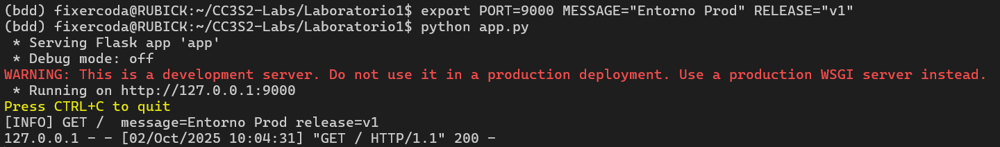
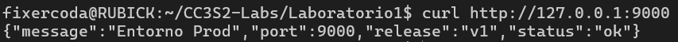
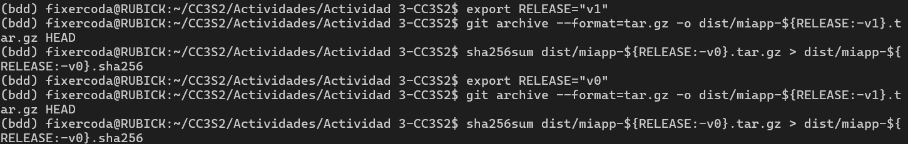
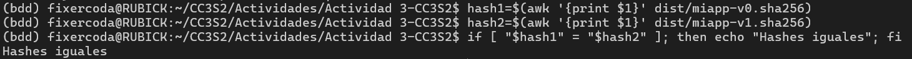
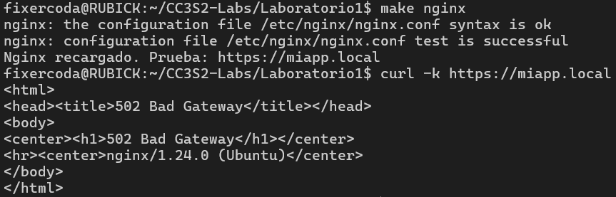
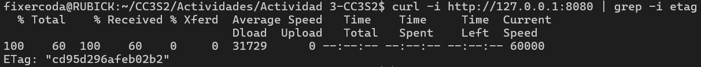
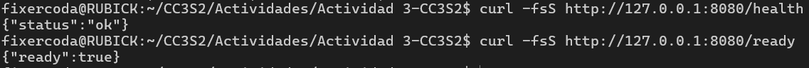
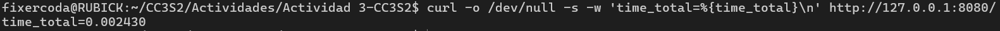

# Actividad 3: Integración de DevOps y DevSecOps con HTTP, DNS, TLS y 12-Factor App

- Nombre: Diego Edson Bayes Santos
- Fecha: 29/09/2025
- Tiempo total:
- Entorno usado: WSL en laptop personal Windows, en el IDE Visual Studio Code

## Parte teórica

### Introducción a DevOps: ¿Qué es y qué no es?

<!-- Explica DevOps desde el código hasta la producción, diferenciándolo de waterfall. Discute "you build it, you run it" en el laboratorio, y separa mitos (ej. solo herramientas) vs realidades (CALMS, feedback, métricas, gates). -->

DevOps es una práctica de desarrollo de software que consiste en la integración del desarrollo y las operaciones en un ambiente de colaboración y apoyándose de herramientas de automatización y observabilidad. A diferencia de un modelo tradicional como el método _waterfall_, en DevOps se implementan cambios en pequeños lotes y de manera iterativa, lo que facilita el feedback y la respuesta ante modificaciones de requerimientos. En esta cultura, se promueve el _you build it, you run it_ para que los equipos tomen responsabilidad por su código y se promueva un ambiente colaborativo óptimo. Contrario a la creencia popular, DevOps no es solo un conjunto de herramientas de automatización, sino un cambio en la cultura y forma de pensar al abordar el desarrollo de software. Incluye seguimiento en todo el proceso desde código hassta la producción con ayuda de la automatización, métricas para observer y medir resultados, y gates de calidad como la verificación automatizada de cadenas de certificados, así como su registro en logs.

### Marco CALMS en acción

<!-- Describe cada pilar y su integración en el laboratorio (ej. Automation con Makefile, Measurement con endpoints de salud). Propón extender Sharing con runbooks/postmortems en equipo. -->

- Cultura (Culture): Consiste en un cambio de mentalidad en el desarrollo de software para transicionar de equipos aislados o silos organizacionales hacia un equipo íntegro y colaborativo que asume las responsabilidades de manera global y no individual (corresponsabilidad). Está presente en todo el proceso DevOps. Un ejemplo para este laboratorio es en `systemd/miapp.service`, donde se define un `placeholder` para que cada integrante escriba su usuario y se encargue de ejecutar el flujo (`you build it, you run it`).
- Automatización (Automation): Implica reducir al mínimo la existencia de tareas manuales para eliminar riesgos potenciales de error humano y agilizar las pruebas, entregas y despliegues, con el uso de herramientas de automatización. En la actividad, se refleja principalmente en el Makefile, el cual agrupa las principales recetas de tareas reproducibles y documentadas.
- Lean: Representa la minimización de código prescindible y los rebuilds innecesarios para optimizar la eficiencia y calidad de los procesos. También se representa en el Makefile, ya que la detección de marcas de tiempo y cambios permite evitar estos rebuilds.
- Medida (Measurement): Consiste en mantener la observabilidad en cada etapa del desarrollo y definir métricas para obtener resultados objetivos y comparables numéricamente. Los targets como `check-http`, `dns-demo` y `check-tls` son herramientas que verifican el estado del software y permiten inspeccionar las métricas que necesita para cumplir los requisitos.
- Compartir (Sharing): Este principio implica percibir el código y los resultados como parte del equipo. Cada integrante debe tener acceso a código documentado y versionado. En archivos como `netplan/01-miapp.yaml`, se puede observar comentarios indicando como usar la configuración, lo que facilita la reproducibilidad por parte del resto del equipo. Esto se puede extender con el uso de `runbooks` y `postmortems` que amplíen la información de uso y análisis de mejoras para futuros proyectos.

### Visión cultural de DevOps y paso a DevSecOps

<!-- Analiza colaboración para evitar silos, y evolución a DevSecOps (integrar seguridad como cabeceras TLS, escaneo dependencias en CI/CD). Propón escenario retador: fallo certificado y mitigación cultural. Señala 3 controles de seguridad sin contenedores y su lugar en CI/CD. -->

La colaboración es un pilar de la visión culutural de DevOps pues los desarrolladores trabajan en conjunto en un entorno de corresponsabilidad y en cada etapa del proyecto. De esta manera, se evita el aislamiento y las paredes entre equipos, características de los silos organizacionales. Además, en la evolución a DevSecOps, se integra las técnicas de seguridad en todo el proceso, y no solo al final del desarrollo, con medidas como el escaneo de dependencias y análisis de código (SAST).  
Un escenario posible involucra la emisión de certificados DNS. Gracias a DevOps, se pueden adoptar medidas para prevenir esto como definir `runbooks` que permitan estandarizar el proceso de renovación de los certificados para todo el equipo y automatizar el proceso de generación de certificados antes de la expiración.  
Posibles controles incluyen la definición de headers de seguridad como `Strict-Transport-Security` dentro del `nginx`, opciones como `Restart=always` en `systemd` para resistencia a fallos, y escaneos de puertos dentro del Makefile.

### Metodología 12-Factor App

<!-- Elige 4 factores (incluye config por entorno, port binding, logs como flujos) y explica implementación en laboratorio. Reto: manejar la ausencia de estado (statelessness) con servicios de apoyo (backing services). -->

- **Config por entorno**: Se puede observar el uso de variables de entorno dentro del Makefile, el archivo `service` del `systemd` o el script `app.py` con la definición de variables por defecto y reemplazables. Esto permite reproducir la operación en distintos entornos y de manera ágil.
- **Port binding**: Dentro del levantamiento del app, se asigna un puerto específico. Además, dentro de la configuración `nginx`, se definen explícitamente los puertos 80 y 443 para escuchar HTTP y HTTPS. Esto incrementa la consistencia entre reproducciones.
- **Logs como flujos**: Se verifica el uso de logs como flujos dentro del script `app.py`, el cual formatea la salida de logs mediante `sys.stdout` y no los registra en archivos `.log`. De esta manera,
- **Procesos y servicios de apoyo**: Este factor se refiere al almacenamiento de estado persistente en un servicio de apoyo, como una base de datos, a diferencia de mantenerlos en cada servicio, asegurando así la consistencia de la información. La comunicación se realiza mediante APIs y define una arquitectura mejor organizada, monitoreable y débilmente acoplado (microservicios). En este laboratorio, se puede externalizar el almacenamiento de estados para casos como la edición y guardado de mensajes en el app. Ante una modificación, en vez de generar un archivo interno o editar el código, se pasa este nuevo estado a una base de datos, donde se puede acceder mediante APIs en cualquier momento.

## Parte práctica

### Automatización reproducible con Make y Bash (Automation en CALMS)

<!-- Ejecuta Makefile para preparar, hosts-setup y correr la app. Agrega un target para verificar idempotencia HTTP (reintentos con curl). Explica cómo Lean minimiza fallos. Haz una tabla de rastreo de objetivos con esta cabeceras, "objetivo -> prepara/verifica -> evidencia" de Instrucciones.md. -->

- El principo Lean minimiza los fallos a través del Makefile gracias a la automatización de procesos. El pipeline se ejecuta de manera automática en recetas reproducibles desde distintos entornos, lo que evita posibles errores manuales. Además, el Makefile cuenta con herramientas importantes que eliminan repeticiones innecesarias y optimiza los recursos.

| Objetivo (Make)         | Prepara / Verifica                                                                 | Evidencia (captura o salida)                                                                            |
| ----------------------- | ---------------------------------------------------------------------------------- | ------------------------------------------------------------------------------------------------------- |
| `make help`             | Muestra los targets con una breve descripción                                      | Captura de consola con la lista de targets                                                              |
| `make debug-venv`       | Diagnostica las rutas que usa el Makefile para su corroboración                    | Captura de consola con la salida de la información                                                      |
| `make prepare`          | Crea el entorno e instala dependencias necesarias para la app                      | Captura de consola con la instalación                                                                   |
| `make venv-recreate`    | Recrea el entorno desde cero                                                       | Captura de consola con la recreación                                                                    |
| `make shell`            | Abre un terminal con el entorno activado                                           | Terminal nuevo con el entorno bdd                                                                       |
| `make run`              | Levanta la aplicación Flask en el puerto configurado                               | Levantamiento del app en `http://localhost:8080/`                                                       |
| `make check-http`       | Verifica los puertos, sockets y HTTP para su uso                                   | Captura de consola que muestra la respuesta HTTP esperada, el socket en modo LISTEN y el puerto abierto |
| `make hosts-setup`      | Configura resolución local para el dominio de la app                               | Captura de consola con la salida de `ping miapp.local` resolviendo a la IP correcta                     |
| `make resolv-show`      | Muestra los archivos `resolv.conf` y la presencia de `miapp.local` en `/etc/hosts` | Captura de la consola con el contenido del archivo y la búsqueda                                        |
| `make dns-demo`         | Demuestra el uso de la herramienta `dig` para consultas DNS                        | Captura de consola con todos los resultados de las consultas                                            |
| `make curl-http-local`  | Prueba HTTP (puerto 80)                                                            | Captura de consola con la respuesta definida                                                            |
| `make curl-https-local` | Prueba HTTP (puerto 443)                                                           | Captura de consola con la respuesta definida                                                            |
| `make tls-cert`         | Genera los certificados TLS                                                        | Captura de los certificados creado en el directorio `certs`                                             |
| `make nginx`            | Instala Nginx y lo recarga                                                         | Levantamiento del app en `https://miapp.local`                                                          |
| `make ufw-open`         | Abre los puertos 80 y 443 en UFW                                                   | Salida de los comandos exitosos                                                                         |
| `make check-tls`        | Valida `handshake` TLS y las cabeceras                                             | Mensajes de confirmación `CONNECTION ESTABLISHED`, respuesta y encabezados HTTP esperados               |
| `make cleanup`          | Elimina archivos temporales y detiene servicios                                    | Captura de consola con la limpieza de archivos                                                          |
| `make idempotency-http` | Comprueba la idempotencia del método GET                                           | Captura de consola con la salida esperada de 3 respuestas iguales                                       |

### Del código a producción con 12-Factor (Build/Release/Run)

<!-- Modifica variables de entorno (PORT, MESSAGE, RELEASE) sin tocar código. Crea un artefacto inmutable con git archive y verifica paridad dev-prod. Documenta en tabla "variable -> efecto observable". Simula un fallo de backing service (puerto equivocado) y resuélvelo con disposability. Relaciona con logs y port binding. -->

- La forma más directa de establecer las variables de entorno es mediante `export` en la consola para diferentes entornos (dev/prod).

    
    

- Se verifica la paridad de los artefactos usando `git archive` mediante la verificación de _hashes_ con diferentes variables de entorno.

    
    

- Documentación de variables de entorno

    | Variable de entorno         |  Efecto observable           |
    | ----------------------- | ------------------------- |
    | `APP_NAME`            | Denota el nombre principal de la aplicación lanzada con `nginx` |
    | `DOMAIN`       | Denota la dirección de la aplicación lanzada con `nginx`                    |
    | `PORT`          | Contiene el puerto usado para el lanzamiento de la aplicación                      |
    | `MESSAGE`       | Contiene el mensaje usado por la aplicación para incluir en el mensaje de respuesta         |
    | `RELEASE`          | Se usa para marcar la versión actual durante el empaquetamiento     |

- Se simuló un fallo en el backend sobreescribiendo la variable de entorno en la configuración del `nginx`. Esto se resuelve rápidamente gracias a la desechabilidad aplicada en la cual se prioriza levantamientos y apagados ágiles para maximizar la robustez del software. Este principio se apoya con el uso de logs para su identificación rápida y las variables de entorno asignadas para cada entorno y no dentro del mismo código.

    

### HTTP como contrato observable

<!-- Inspecciona cabeceras como ETag o HSTS. Define qué operaciones son seguras para reintentos. Implementa readiness y liveness simples, y mide latencias con curl. Documenta contrato mínimo (campos respuesta, trazabilidad en logs). Explica cómo definirías un SLO. -->

- Se añadió la cabecera _ETag_ a la aplicación y se inspeccionó el resultado nuevo.

    

- En HTTP, un método idempotente es aquel que produce la misma salida para una misma entrada, lo que lo convierte en un método seguro para reintentos. Con métodos como GET, PUT, OPTIONS o HEAD, se obtiene el mismo resultado para _requests_ idénticos. Además, el método DELETE remueve un recurso y en reintentos posteriores recibe estados de "no encontrado", por lo que también no genera cambios adicionales y se considera idempotente. Es importante que el endpoint principal pueda ser inspeccionado de manera idempotente para evitar modificaciones silenciosas y que afecten la funcionalidad requerida.

- Se implementaron endpoints mínimos de salud (_health_) y preparación lista (_ready_) para verificar el estado de la aplicación y que sirvan como puntos de inspección. Además, se pueden medir las latencias con la herramienta `curl`.

    
    

- Contrato de salida:
  
  - Endpoints de respuesta
    - `GET /`
    Propósito: Endpoint principal de la aplicación

    ```json
    {"message":"Hola","port":8080,"release":"v0","status":"ok"}
    ```

    - `GET /health`
    Propósito: Health check de liveness (proceso vivo)

    ```json
    {"status": "ok"}
    ```

    - `GET /ready`
    Propósito: Health check de readiness (listo para tráfico)

    ```json
    {"ready": true}
    ```

  - Trazabilidad en Logs

    ```python
    print(f"[INFO] GET /  message={MESSAGE} release={RELEASE}", file=sys.stdout, flush=True)
    ```

- Definición de un SLO:
  - Latencia
    - Objetivo: 95% de requests < 10ms
    - Percentil: p95 response time
    - Endpoint: Principal (GET /)

### DNS y caché en operación

<!-- Configura IP estática en Netplan. Usa dig para observar TTL decreciente y getent local para resolución de miapp.local. Explica cómo opera sin zona pública, el camino stub/recursor/autoritativos y overrides locales. Diferencia respuestas cacheadas y autoritativas. -->

### TLS y seguridad en DevSecOps (Reverse Proxy)

<!-- Genera certificados con Make y configura Nginx como proxy inverso. Verifica el handshake TLS con openssl y revisa las cabeceras HTTP con curl. Explica la terminación TLS en el puerto :443, el reenvío de tráfico hacia 127.0.0.1:8080 y las cabeceras de proxy relevantes. Indica las versiones de TLS permitidas y justifica las diferencias entre el entorno de laboratorio y el entorno de producción (por ejemplo, compatibilidad vs. endurecimiento de seguridad). Comprueba la redirección de HTTP a HTTPS y la presencia de HSTS (recuerda: HSTS es una cabecera HTTP, no parte del handshake TLS). Diseña un gate de CI/CD (puerta de calidad) que detenga el pipeline cuando no se cumpla TLS v1.3 como mínimo. Describe:
- Condición (detectar versión TLS efectiva en el endpoint),
- Evidencia (salida del comando que valida la versión), y
- Acción (fallar el job con un código de salida ≠ 0 para evitar la promoción a la siguiente etapa). -->

### Puertos, procesos y firewall

<!-- Usa ss/lsof para listar puertos/procesos de app y Nginx. Diferencia loopback de expuestos públicamente. Presenta una "foto" de conexiones activas y analiza patrones. Explica cómo restringirías el acceso al backend y qué test harías para confirmarlo. Integra systemd: instala el servicio, ajusta entorno seguro y prueba parada. Simula incidente (mata proceso) y revisa logs con journalctl. -->

### Integración CI/CD

<!-- Diseña un script Bash que verifique HTTP, DNS, TLS y latencias antes del despliegue. Define umbrales (ej. latencia >0.5s falla). Ejecuta el script antes y después de una modificación (por ejemplo, cambio de puerto) y observa cómo se retroalimenta CALMS. -->

### Escenario integrado y mapeo 12-Factor

<!-- En este ejercicio deberás trabajar con un endpoint de la aplicación (por ejemplo, GET /) y modificarlo conceptualmente para introducir un fallo no idempotente, es decir, que al repetir la misma solicitud se altere el estado o la respuesta. La evidencia debe mostrar cómo dos peticiones idénticas generan resultados distintos y por qué esto rompe la idempotencia, afectando reintentos, cachés y balanceadores. -->

<!-- Posteriormente, realiza un despliegue manual tipo blue/green, manteniendo dos instancias: una estable (Blue) y otra con el fallo (Green). Documenta cómo harías la conmutación de tráfico de Blue a Green únicamente si pasa los chequeos de readiness y liveness, y cómo ejecutarías un rollback rápido si se detecta el problema. -->

<!-- A continuación, redacta un postmortem que incluya un resumen del incidente, una línea de tiempo, impacto en usuarios, causa raíz, lecciones técnicas y culturales, además de acciones preventivas desde una perspectiva DevSecOps. Después, propone un runbook breve, entendido como un procedimiento paso a paso que cualquier integrante del equipo pueda seguir en caso de repetir el incidente. -->

<!-- Finalmente, completa una tabla con seis factores de 12-Factor App, explicando para cada uno: el principio, cómo está implementado en el laboratorio, la evidencia recogida y qué mejora propondrías hacia producción. -->
