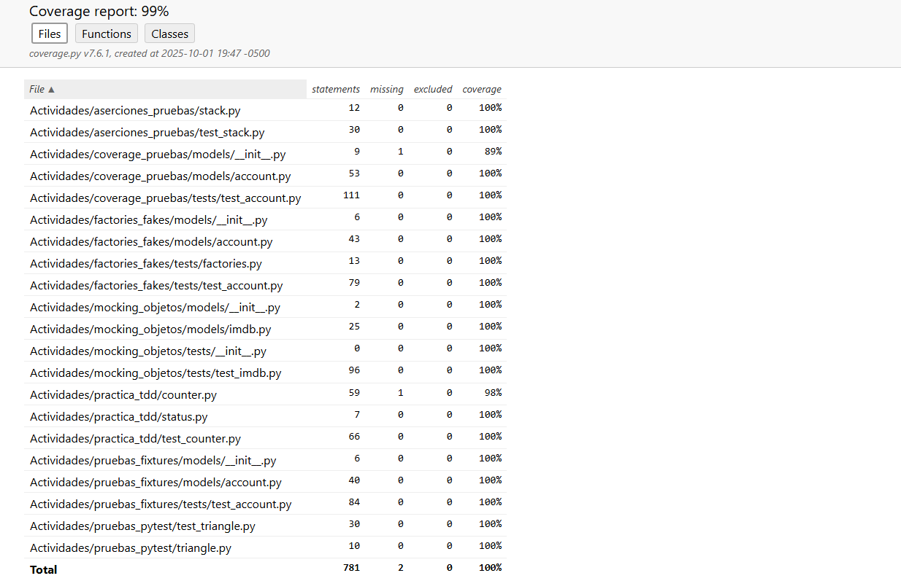

## Actividad 9 - pytest + coverage + fixtures + factories + mocking + TDD

-   Nombre: Diego Edson Bayes Santos
-   Fecha: 01/10/2025
-   Tiempo total: 4h
-   Entorno usado: WSL en laptop personal Windows, en el IDE Visual Studio Code

### Guía de uso

-   Versión de Python: Python 3.12.3
-   Creación de entorno:

    ```bash
    python -m venv .venv
    source .venv/bin/activate
    make install
    ```

-   Ejecución de pruebas:

    ```bash
    make test_all
    make test ACTIVITY=<nombre_de_actividad>
    ```

-   Cobertura completa:

    ```bash
    make coverage
    make coverage_individual
    ```

-   Cobertua por actividad (Puedes configurar el `setup.cfg` dentro de cada directorio para cobertura personalizada, pero afectará a la cobertura completa):

    ```bash
    make coverage ACTIVITIES=<nombre_de_actividad>
    ```

-   Limpieza de archivos generados:

    ```bash
    make clean
    ```

### Secciones

#### Aserciones Pruebas

Se escribió 1 prueba para cada uno de los 4 métodos de `stack.py`:

-   `is_empty()`
-   `pop()`
-   `peek()`
-   `push(data)`

El reporte del coverage muestra que se cubrió el 100% del código.

#### Pruebas Pytest

Las pruebas de `pytest` en esta actividad cubren casos para distintos tipos de inputs (como `int` o `float`), casos frontera (como lados que miden 0 o negativo) y que activen los errores esperados.

El reporte del coverage muestra que se cubrió el 100% del código.

#### Pruebas Fixtures

Se implementaron 7 nuevas pruebas para alcanzar la cobertura completa:

-   Representación de la cuenta en `str`
-   Serialización de una cuenta en un diccionario
-   Establecimiento de atributos de una cuenta desde un diccionario
-   Actualización de una columna de una cuenta
-   Validación de error en la actualización de un id de cuenta inexistente
-   Búsqueda de una cuenta con su id
-   Eliminación de una cuenta

El reporte del coverage muestra que se cubrió el 100% del código.

#### Coverage Pruebas

Se expandió la suite de pruebas para la validación de información de una cuenta:

-   Validación del nombre de una cuenta
-   Validación del correo de una cuenta
-   Salida exitosa tras pasar validación

#### Factories Fakes

Se mejoró el caso de `fixtures` con el uso de `factories` para reemplazar los datos fabricados manualmente de cuentas en un archivo `json`.

#### Mocking Objetos

Se emplearon `mocks` para replicar respuestas de IMDb sin necesidad de acceder a la API, lo que reduce las dependencias en la fase de pruebas sin reducir efectividad.

Se implementaron las pruebas faltantes para la cobertura completa:

-   Reviews de películas no encontradas
-   Ratings de películas no encontradas

#### Practica TDD

Se comenzó refactorizando el código existente para mejorar el funcionamiento. El principal cambio fue la implementación del decorador `require_counter`, el cual corrobora la existencia de un contador como precondición para los métodos que lo requieran.

Se implementaron 4 nuevas pruebas:

-   Incrementar un contador en 1
-   Establecer valor específico
-   Listar todos los contadores
-   Reiniciar un contador

### Resumen de pruebas

-   Número total de pruebas: 63
-   Porcentaje de cobertura: 99%


