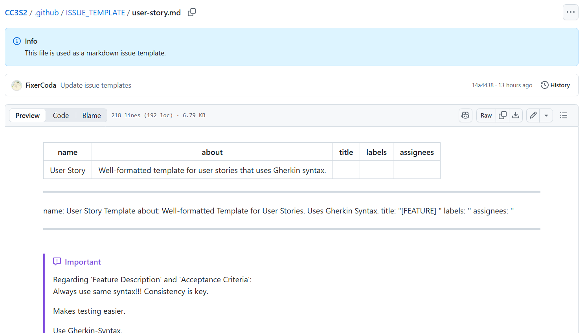
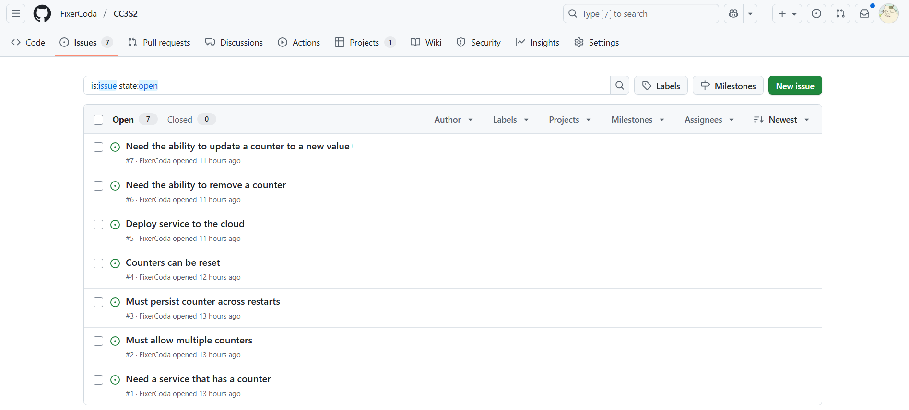
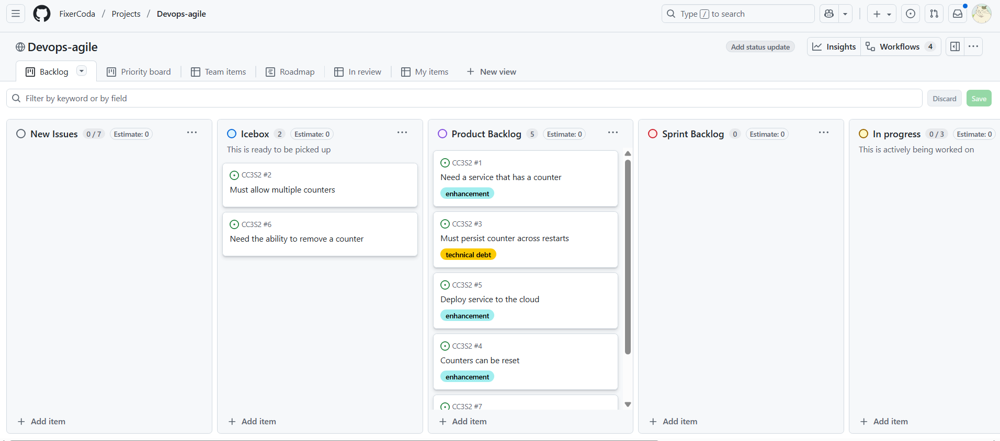
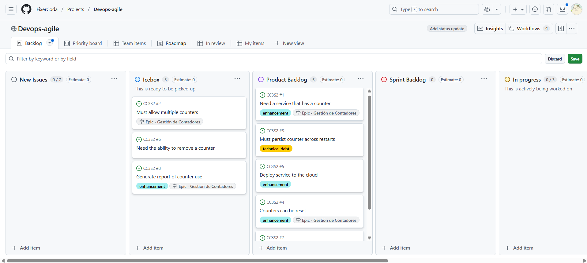
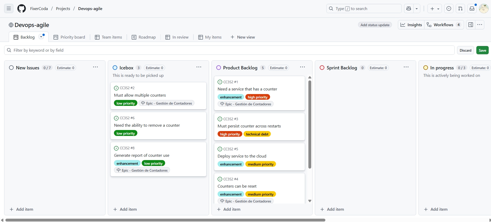
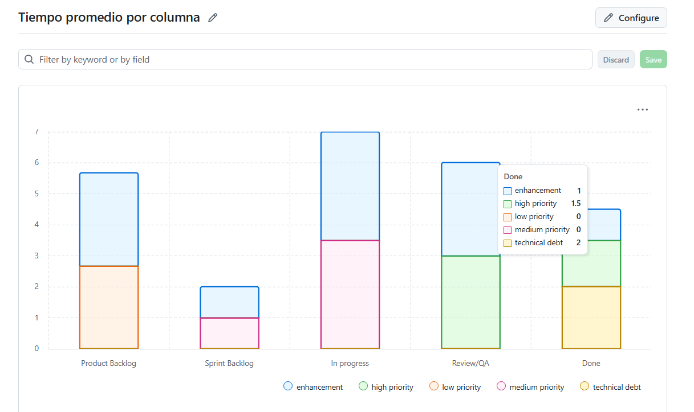
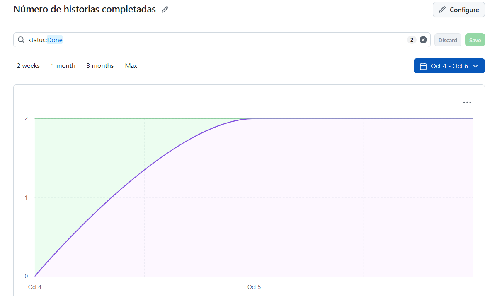

# Actividad 11 - Gestión ágil de proyectos con GitHub Projects, configuración de Kanban Board y creación de historias de usuario

- Nombre: Diego Edson Bayes Santos
- Fecha: 05/10/2025
- Tiempo total: 4h
- Entorno usado: IDE Visual Studio Code y Github

## Instrucciones

### Parte 1: Configuración inicial

### Parte 2: Issue Template

### Parte 3: Historias de usuario

### Parte 4: Refinamiento de backlog

## Ejercicios

### Ejercicio 1: Crear un epic y vincular historias de usuario

### Ejercicio 2: Uso avanzado de etiquetas (labels) para priorización y estado

### Ejercicio 3: Automatización de Kanban board con GitHub Actions

Se implementaron las siguientes reglas de automatización:

- Move to In Progress when PR created
- Move to Review/QA when PR ready for review
- Move to Done when PR merged or issue closed

### Ejercicio 4: Seguimiento de tiempo y esfuerzo usando GitHub Projects

### Ejercicio 5: Refinamiento de backlog basado en comentarios de los stakeholders

### Ejercicio 6: Análisis del flujo de trabajo usando el Kanban board

Se modificó el Kanban para poder revisar las métricas del proyecto.

Métrica: Tiempo promedio en cada columna

Métrica: Número de historias completadas

