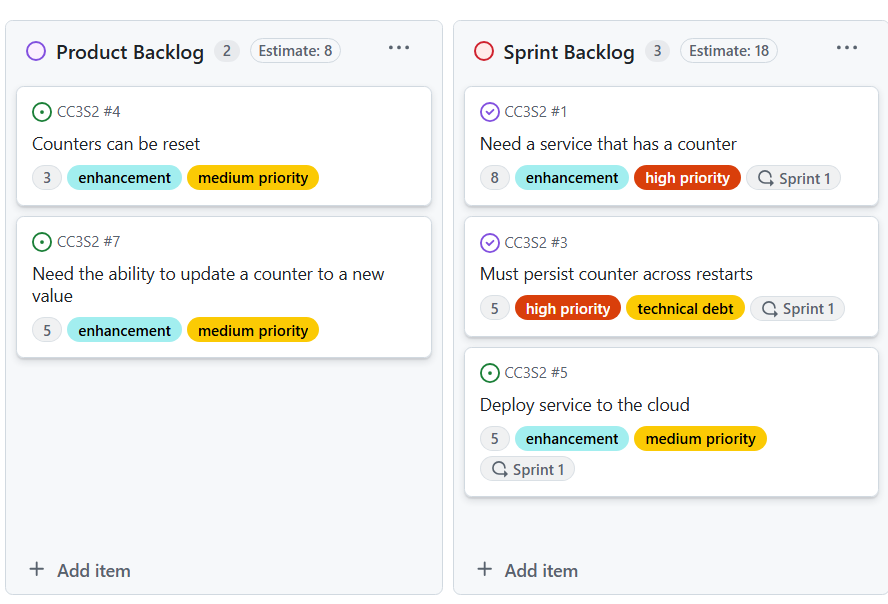
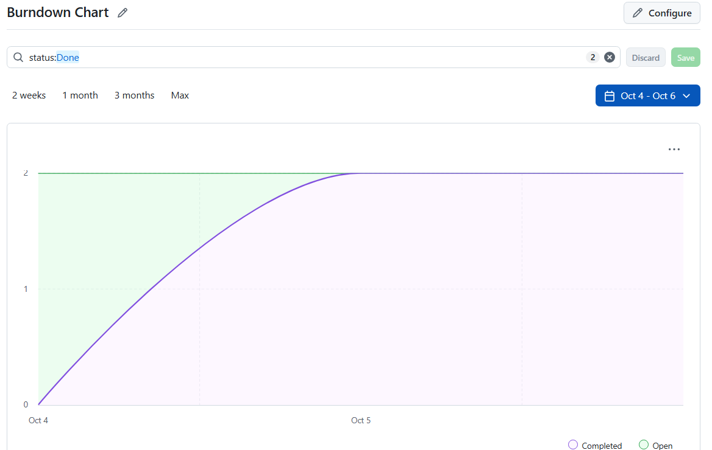
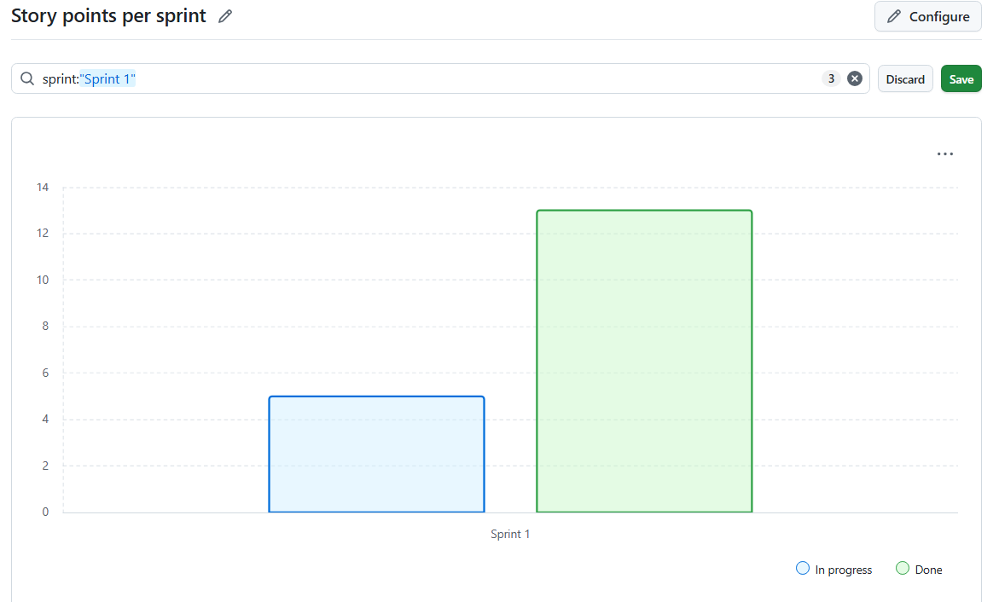
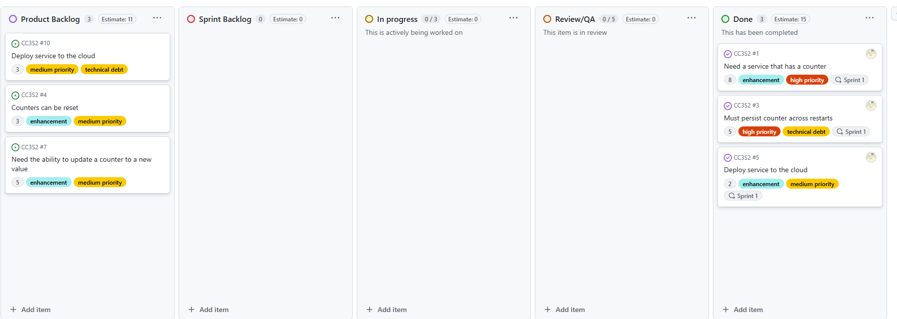

# Actividad 11 - Gestión ágil de sprints con GitHub, planificación, ejecución y cierre de Sprints

- Nombre: Diego Edson Bayes Santos
- Fecha: 05/10/2025
- Tiempo total: 1h
- Entorno usado: IDE Visual Studio Code y Github

## Parte 1: Crear un Sprint plan

## Parte 2: Flujo de trabajo diario

## Parte 3: Configurar tu Burndown Chart y métricas de progreso

## Parte 4: Gestionar el trabajo incompleto

