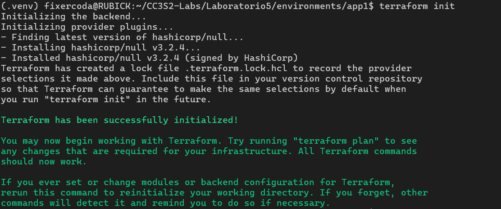
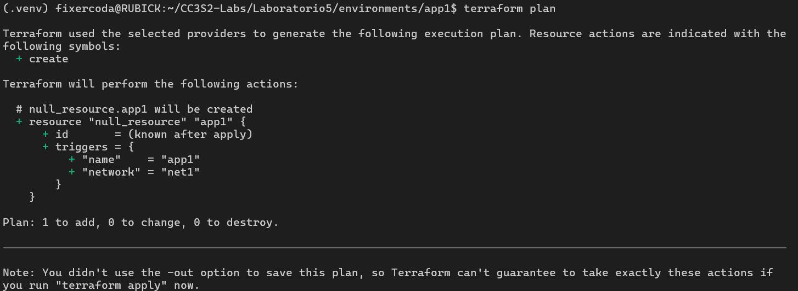
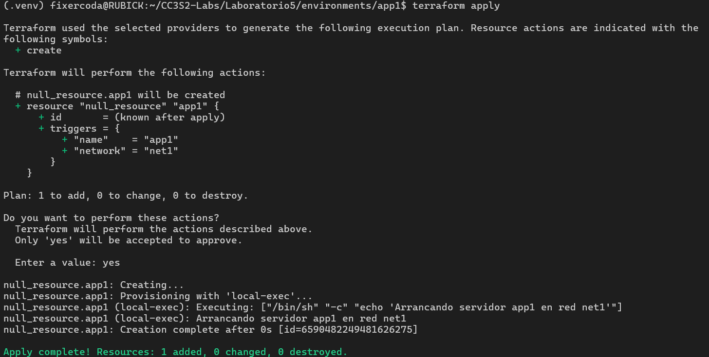
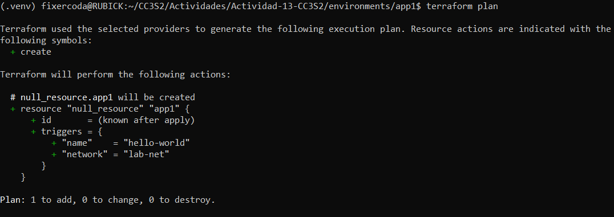
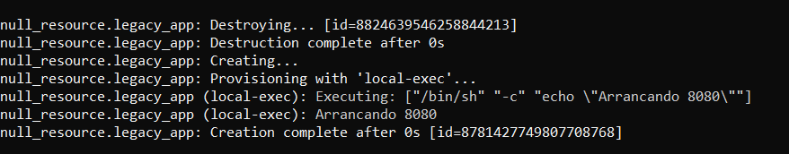

# Actividad 13 - Escribiendo infraestructura como código en un entorno local con Terraform

- Nombre: Diego Edson Bayes Santos
- Fecha: 26/10/2025
- Tiempo total: 0h
- Entorno usado: WSL en laptop personal Windows, en el IDE Visual Studio Code

## Fase 0: Preparación

```bash
terraform init
```



```bash
terraform plan
```



```bash
terraform apply
```



## Fase 1: Expresando el cambio de infraestructura

```bash
terraform plan
```



- ¿Cómo interpreta Terraform el cambio de variable?

Terraform lee los valores de las variables en los archivos .tfvars, en las variables de entorno, o en los valores por defecto de su definición, tal como este caso. Luego, los sustituye con los valores resueltos para generar la configuración final.

- ¿Qué diferencia hay entre modificar el JSON vs. parchear directamente el recurso?

Al modificar el JSON, se mantiene un registro de este cambio, lo que convierte al proceso en reproducible y versionable, lo cual no se logra al ejecutar un comando específico para cambiar dicho estado.

- ¿Por qué Terraform no recrea todo el recurso, sino que aplica el cambio "in-place"?

Terraform puede aplicar cambios *in-place* para evitar destruir y crear el recurso en casos específicos y siempre que sea posible. Esto permite actualizaciones eficientes y más rápidas.

- ¿Qué pasa si editas directamente main.tf.json en lugar de la plantilla de variables?

Si se edita main.tf.json directamente, se perdería la separación de configuración y valores, lo que afecta la reutilización de estos y favocere el acoplamiento del código.

## Fase 2: Entendiendo la inmutabilidad

```bash
python legacy_to_terraform.py
cd converted
terraform init
terraform plan
terraform apply
```



## Fase 3: Escribiendo código limpio en IaC
