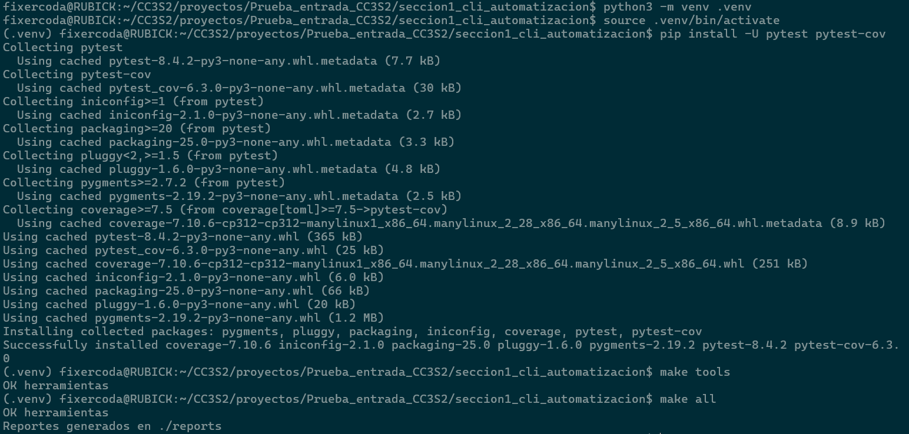
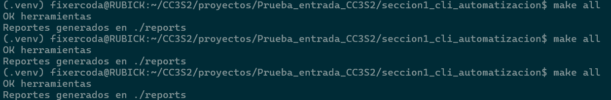

## Prueba de Entrada

-   Nombre: Diego Edson Bayes Santos
-   Fecha: 08/09/2025
-   Tiempo total: 1.5h
-   Entorno usado: WSL en laptop personal Windows, en el IDE Visual Studio Code

### Sección 1 - CLI y Automatización

-   Los reportes se generan correctamente y se añadieron las explicaciones correspondientes.
-   Se generó un entorno virtual para la instalación de librerías. El makefile se ejecuta exitosamente.

-   Además, se verificó la idempotencia del flujo.

### Sección 2 - Python + Tests y Git

### Sección 3 - Redes, HTTP/TLS y API
