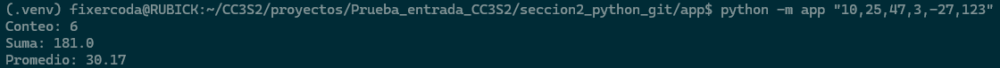
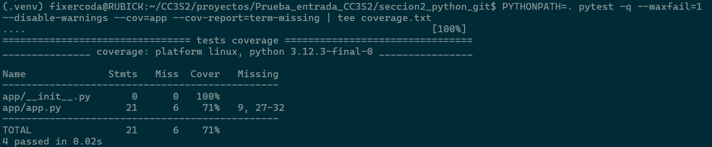
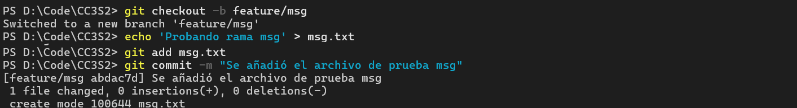
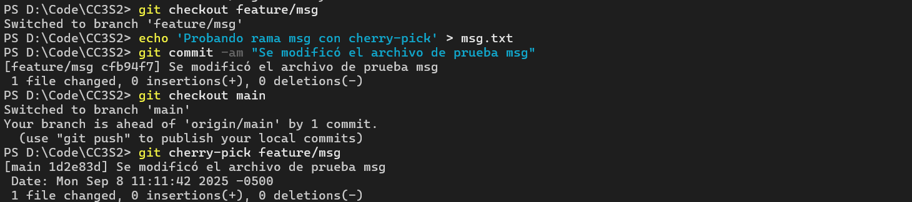
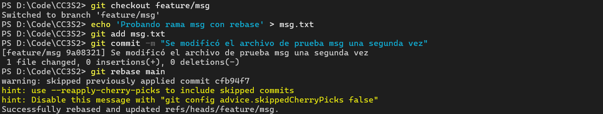

## Prueba de Entrada

-   Nombre: Diego Edson Bayes Santos
-   Fecha: 08/09/2025
-   Tiempo total: 3.5h
-   Entorno usado: WSL en laptop personal Windows, en el IDE Visual Studio Code

### Sección 1 - CLI y Automatización

-   Los reportes se generan correctamente y se añadieron las explicaciones correspondientes.
-   Se generó un entorno virtual para la instalación de librerías. El makefile se ejecuta exitosamente.

-   Además, se verificó la idempotencia del flujo.

### Sección 2 - Python + Tests y Git

-   Se implementó la función _summarize_ y se validó en _main_.

-   Se completaron las pruebas para su ejecución con _pytest_

-   Se creó la rama _feature/msg_ y se realizaron las 3 técnicas para integración de cambios.

-   Estas técnicas ayudan a mantener un flujo de trabajo ordenado y a aplicar fixes puntuales de forma controlada.
    -   **Fast-forward merge (FF):** Integra cambios linealmente cuando la rama está adelantada; no crea commits extra.
    -   **Rebase:** Reescribe la historia aplicando commits encima de otro branch, manteniendo un historial más limpio.
    -   **Cherry-pick:** Copia un commit específico a otra rama sin traer toda la historia.

### Sección 3 - Redes, HTTP/TLS y API

-   La cabecera Content-Type contiene el tipo original de media (MIME) del recurso consultado. Estos pueden ser texto, videos, audios, imágenes, con sus respectivas extensiones.
